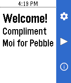
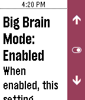
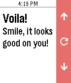

# Compliment Moi for Pebble
Get a compliment and some encouragement from your Pebble smartwatch with this fun little [Pebble.JS](https://github.com/pebble/pebblejs) app! Tested on Pebble 301BL and Time smartwatches running the latest firmware.

### Features
- Get a compliment or some words of encouragement!
- No need to update to the latest version of the app when new compliments are added! The [compliments.json](compliments.json) file that contains all the compliments is fetched whenever you run the app.
- When enabled, the all-new "Big Brain Mode" setting sometimes specifically tailors compliments to better match the current time of day.

### Screenshots

### Extras
- Compliments list forked from [here](https://gist.github.com/bmatheny/59cd6b745f464bd5599e0d9ab924903c).
